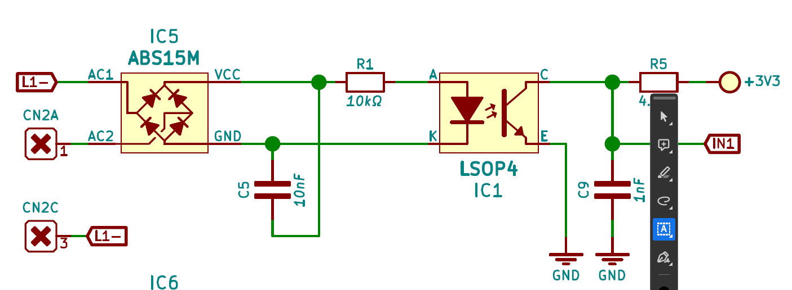
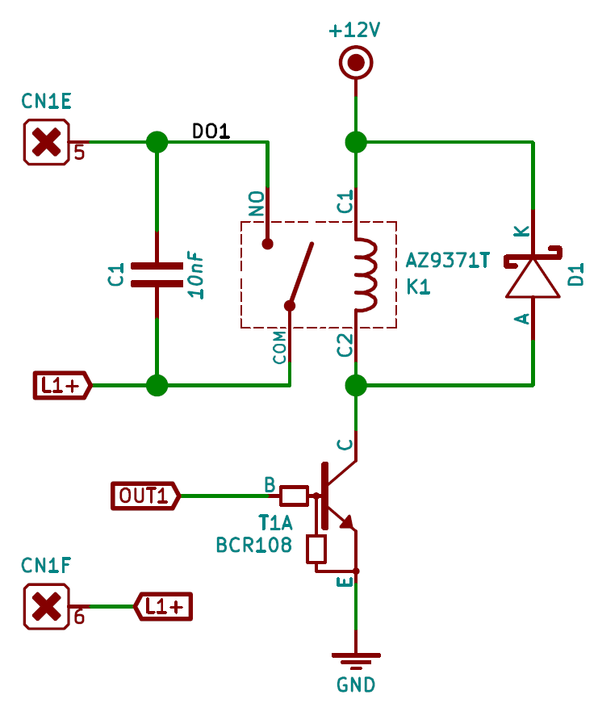
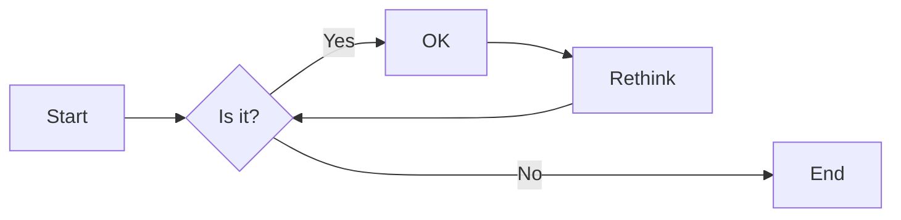
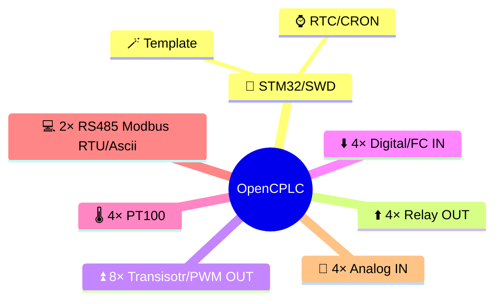

# PLC

Jeszcze dużo do zrobienia [TODO](./todo.md)

Nasz sterownik _pracuje_ na **STM32** i programuje się go za pomocą [STM32CubeIDE](https://www.st.com/en/development-tools/stm32cubeide.html) w języku `Ansi C`

---

## Wyjścia i wejścia cyfrowe

### Wejścia cyforowe



### Wyjścia cyfrowe



Mamy 2 typy wyjść cyfrowy

a. Przekażnikowe
b. Tranzystorowe 🏀

- NC/NO
- NO

## Wejścia temperaturowe

```bash
py test.py # wywołanie
```

$$
\frac{s^{2}\alpha\sqrt{2}}{\sqrt[3]{\beta}}
$$

## Wejścia analogowe

Struktura pliku `FILE_t`

```c
typedef struct {
  const char *name; // nazwa
  uint8_t *buffer;
  uint16_t size;
  uint16_t limit;
  bool mutex;
  uint8_t flash_page;
  uint16_t _offset;
  uint16_t struct_size;
} FILE_t;
```

| a   | b   | c   | d   | e   |
| --- | --- | --- | --- | --- |
| 1   | 1   | 4   | 5   | 8   |
| 2   | 2   | 5   | 6   | 8   |
| 3   | 3   | 5   | 7   | 7   |

## Interfejs R485

> Hej to Arek
>
> > Siema



## Planista CRON



MS Word:

- Większa popularność
- Lepszy w papier

MD:

- Za free
- Oddzielenie formy od treści
- Lepszy w internet
- Sledzenie zmian
- Dokumentacja hierarchiczna
- Lepsze współtworzenie dokumentów
