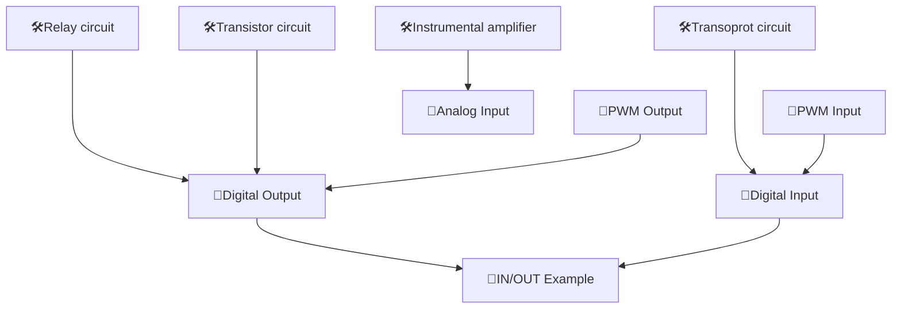

```mermaid
flowchart TB

  IN[🛠️Transoprot circuit]
  RO[🛠️Relay circuit]
  TO[🛠️Transistor circuit]
  AMP[🛠️Instrumental amplifier]
 

  DO[📄Digital Output]
  DI[📄Digital Input]
  PWM[📄PWM Output]
  PWMI[📄PWM Input]
  AI[📄Analog Input]
 

  IO[🧩IN/OUT Example]

  IN--->DI
  RO--->DO
  TO--->DO

  DO-->IO
  DI-->IO

 PWMI-->DI
  PWM-->DO

 


  


  AMP-->AI
  

 


```


```
 UART[📄UART]
  MBR[📄Modbus RTU]
  MBA[📄Modbus ASCII]
```
